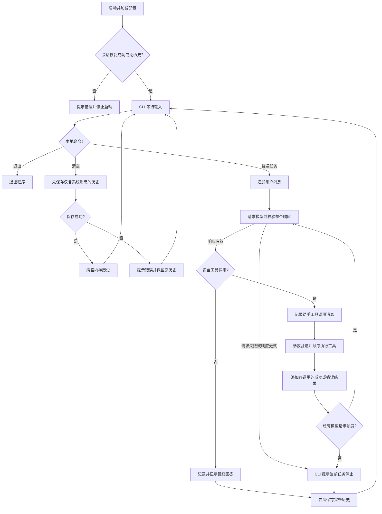

# ZipClaw

一个参考 pi 风格分层思路、使用 Python 从零实现的学习型编程智能体。

当前已完成编程智能体的基础闭环：**输入任务 → 模型选择工具 → 执行工具 → 回传结果 → 模型回答**。支持终端连续对话、六个工具、执行过程展示、按工作区保存与恢复会话，以及常见模型请求错误和无效响应的处理。项目正在从“功能跑通”进入“稳定可用”的阶段。

长期目标是逐步实现能够理解项目、修改代码、运行测试并根据结果修复问题的编程智能体。这里不是 pi-mono 的直接移植，也不是已经具备完整能力的 OpenClaw。

## 当前能力

- 在终端持续聊天，保留对话与工具调用历史；重新启动时恢复同一工作区的已保存会话。
- 通过 OpenAI 兼容的 Chat Completions 接口调用模型，允许配置服务地址和模型名称。
- 使用 Pydantic 定义工具参数、生成 JSON 参数结构，并在执行前验证参数。
- 支持一次模型回复中的多个工具调用，当前按顺序执行。
- 保留模型返回的 `reasoning_content` 字段，在后续消息中回传。
- 使用 `list_dir` 查看目录，使用 `read_file` 读取文本文件。
- 使用 `write_file` 新建文件，不覆盖已有文件。
- 使用 `edit_file` 精确替换已有文件的一处文本，匹配不唯一时拒绝修改。
- 使用 `grep` 搜索文件内容，返回相对路径、行号和匹配行。
- 使用 `run_command` 执行程序，返回正常输出、错误输出和退出码，支持超时与输出截断。
- 显示请求轮次、工具名称、参数预览、结果预览，以及模型服务返回的推理文本。
- 工具说明、模型提示词和项目自定义反馈使用中文。
- 文件工具检查工作区路径边界；命令执行工具仅设置启动目录，不提供文件访问隔离。
- 将部分工具执行异常转换成工具结果，让模型有机会调整参数。
- 每个用户任务默认最多请求模型 10 次；达到上限后保存已有历史，回到输入界面。
- 为连接失败、超时、认证失败等常见请求错误提供中文提示，任务停止后仍可继续输入。
- 在适配层检查工具参数 JSON、调用 ID、名称和部分回复字段；无效响应不进入历史，本轮工具不执行。
- 使用 Python 自带的 `unittest` 测试工具、核心循环和会话存储。

配置兼容接口不代表所有服务、模型与推理模式都已经验证兼容；当前适配器仍使用同一套消息格式。

## 当前进度与下次继续的位置（2026-10-09）

已完成模型适配层、智能体循环、工具注册表和终端应用的最小实现。六个工具已注册，可以完成简单的文件查看、代码修改与运行验证任务；此前已有 `git --version` 和 `calculator.py` 简单修复任务的成功记录。

最近完成的功能：

- 核心循环支持多轮和批量工具调用，并把工具结果与调用 ID 对应起来。
- 系统提示词要求执行 Python 时优先检查目标工作区的虚拟环境；这是一条模型指令，工具没有自动替换解释器。
- 执行过程可见，达到步数上限后停止当前任务，保留历史并继续等待输入。
- `SessionStore` 将完整历史保存到 JSON；启动恢复、工作区隔离和 `/clear` 同步保存已经接入 CLI。
- SDK 自动重试已关闭，网络请求超时参数设为 120 秒。常见请求错误和部分无效响应由适配器转换为项目异常，再由 CLI 显示中文提示。
- 同一响应中的工具调用全部解析成功后才交给核心循环；第二个调用解析失败时，这一轮的第一个调用也不会执行。

已保存的自动化测试共 91 项：工具层 68 项、核心循环 20 项、会话存储 3 项。2026-10-09 最近一次完整运行结果为 **86 项通过、5 项因符号链接权限跳过，没有失败项**。

会话接入、请求失败后继续聊天，以及 12 类无效响应与历史保护还做过临时离线验证。这些验证没有调用真实 API，但脚本尚未保存为正式测试文件，也不能代表所有模型服务都兼容。

下一步优先将模型适配器和 CLI 的临时验证整理成可重复运行的正式测试，再完善文件读取上限和上下文管理。继续使用清楚的中间变量、普通循环和中文注释，按小步骤学习。

## 快速开始

以下命令以 Windows PowerShell 为例。推荐先把项目安装为 `zipclaw` 命令，以后在任意目标项目目录启动。

### 1. 准备环境

需要 uv、Python 3.12 或更新版本，以及可用的模型 API Key。使用的模型需要支持工具调用。

安装一次命令（路径替换为你自己的 ZipClaw 源码目录）：

```powershell
uv tool install --editable "C:\Users\28657\Desktop\ZipClaw"
uv tool update-shell
```

- `uv tool install` 为工具管理独立环境、安装依赖并生成命令，不使用项目的 `.venv`，也不是发布或上传项目。
- `--editable` 让命令使用这份本地源码，修改 Python 文件后无需重新安装。
- `uv tool update-shell` 按需更新 PATH，让终端能找到命令。首次设置后重新打开终端。

项目已经配置 setuptools 构建后端、`src` 包发现及命令入口：

```toml
[project.scripts]
zipclaw = "zipclaw.cli:entrypoint"
```

执行 `zipclaw` 会调用同步函数 `entrypoint()`，由它通过 `asyncio.run(main())` 启动异步 CLI。

### 2. 配置环境变量

在项目根目录创建 `.env` 文件，填写以下配置（全部示例值都需要按自己的服务替换）：

```dotenv
OPENAI_API_KEY=your_api_key_here
OPENAI_BASE_URL=https://your-provider.example/v1
OPENAI_MODEL=your_tool_capable_model_id
```

| 变量 | 说明 |
| --- | --- |
| `OPENAI_API_KEY` | 必填，模型服务的 API Key |
| `OPENAI_MODEL` | 必填，该服务实际支持的模型 ID |
| `OPENAI_BASE_URL` | 第三方兼容服务需要填写；省略时使用 SDK 默认地址 |

`OPENAI_*` 是当前代码使用的变量名，并不限制你只能使用 OpenAI 服务。使用 DeepSeek 时，填写你在 DeepSeek 使用的兼容 API 地址、模型 ID 和密钥即可；无需为了变量名称去申请另一家的密钥。

CLI 使用 `load_dotenv()` 加载配置。已有的进程环境变量通常会优先于 `.env`，修改文件后如果配置没有生效，也要检查终端里是否设置了同名变量。

`.env` 已被 `.gitignore` 忽略。不要把真实 Key 写进 README、源码或提交记录。

### 3. 启动

安装完成后，在想让智能体操作的目录执行：

```powershell
zipclaw
```

直接在终端输入 `zipclaw` 即可。在 Windows 文件资源管理器的地址栏，也可以输入 `cmd /k zipclaw`，打开命令行并在程序退出后保留窗口。

### 4. 试一次工具调用

```text
> 先查看项目根目录，再读取 pyproject.toml，告诉我用了哪些依赖。

ZipClaw > ……

> 再看看 src/zipclaw/core 目录。

ZipClaw > ……
```

终端会显示轮次、工具参数与结果预览，最后显示模型回答。参数预览最多显示前 300 个字符，结果预览最多显示前 500 个字符；这只影响终端展示，不额外缩短保存和回传的内容。模型服务提供 `reasoning_content` 时也会显示，当前显示开关写在核心循环中。

工具结果进入上下文后，模型仍可能给出总结。想看原文时可以明确要求“逐字返回原文，不要概括”；最终展示方式仍由模型响应决定。

### 修改源码后如何生效

可编辑安装后，修改 `.py` 文件，只需在正在运行的 ZipClaw 中输入 `exit`，然后回到 PowerShell 再执行 `zipclaw`。新进程会加载更新后的源码；原来进程不会自动热更新。

不需要重新打开终端，也不需要每次修改都运行安装命令。在同一工作区重启会恢复已保存的历史，并使用代码中最新的系统提示词。想开始新对话，可以输入 `/clear`。

如果修改了依赖、包配置或命令入口，可以重新安装工具环境：

```powershell
uv tool install --force --editable "C:\Users\28657\Desktop\ZipClaw"
```

可编辑安装依赖原源码目录。移动目录后应按新路径重新安装，不要直接删除源码目录。

### 可选：使用项目本地环境开发

如果不需要用户级 `zipclaw` 命令，也可以在 ZipClaw 根目录执行：

```powershell
uv sync
.\.venv\Scripts\python.exe -m zipclaw.cli
```

`uv sync` 管理项目 `.venv`，与 `uv tool install` 管理的工具环境是两套环境。更新其中一套的依赖，不代表另一套同步更新。这里仍按包启动，不要直接运行 `src/zipclaw/cli.py`。

## 聊天命令

| 输入 | 行为 |
| --- | --- |
| 普通文本 | 追加到当前会话，交给智能体执行 |
| `/clear` | 将仅含当前系统消息的历史保存成功后，清空内存历史；不调用模型 |
| `exit` 或 `quit` | 退出程序，大小写均可 |
| 空输入 | 忽略，不调用模型 |

注意：当前只有 **`/clear`** 是清空命令。

正常任务结束或遇到已处理的任务异常后，会尝试保存历史。`exit` 本身不再次保存。清空对话不会删除工作区文件，模型之后仍可通过工具重新读取文件。

## 会话保存与恢复

每个工作区目前对应一份会话文件，默认自动恢复，没有会话列表或多会话切换命令。

文件位置由 `Path.home()` 确定，本机示例：

```text
C:\Users\28657\.zipclaw\sessions\<工作区标识>.json
```

程序将解析、规范化后的工作区绝对路径转换成 SHA-256 标识，用作文件名。不同工作区使用不同文件；移动项目后路径改变，会对应另一份会话。标识不是聊天内容的加密，JSON 中保存的是可读取的历史。

保存内容包括系统消息、用户消息、助手回答、工具调用、工具结果，以及返回过的推理字段。保存时先写同目录的 `.tmp` 文件，关闭后替换正式文件。当前按单进程使用设计，不支持两个窗口同时可靠地写入同一工作区会话。

启动时，CLI 保留新创建 Agent 的系统提示词，仅恢复旧记录中的后续消息，避免旧提示词覆盖新代码。文件不存在时正常开启新会话；文件无法读取、JSON 损坏或基础结构不符时停止启动，保留原文件。

当前加载检查消息列表、消息字典和角色，CLI 还要求非空历史的第一条为系统消息。尚未完整验证历史中的工具调用与结果是否成对，也没有崩溃恢复机制。

验收方式：

1. 在某个工作区启动，输入“这个项目叫小熊，请记住，不需要写文件”。
2. 等待回答后输入 `exit`，在同一工作区重启。
3. 确认出现“已恢复……条历史消息”，询问“刚才项目叫什么”。
4. 输入 `/clear`，再重启，确认恢复的历史消息数量为 0。

会话保存失败时会显示提示，历史仍保留在内存中。`/clear` 保存失败时不清空内存；任务执行中途意外退出，则只保证此前成功保存的历史仍可读取。

## 工作区

工作区取自 `Path.cwd().resolve()`，也就是**启动时终端所在目录**解析后的路径，不是固定的源码目录。启动时会打印工作区和会话文件位置。

模型使用相对于工作区根目录的路径，例如 `src/main.py`。文件工具负责拼接路径并检查是否越界。文件工具当前限制的是“不能访问工作区外”，并未单独禁止工作区内的绝对路径输入。

`run_command` 的 `cwd` 只表示程序从哪个目录启动，不限制被启动程序访问其他目录。它与文件工具的路径边界检查是不同机制。

安装命令后，要分析其他项目，只需切换目录运行：

```powershell
# 替换成要分析的项目目录。
Set-Location "C:\path\to\another-project"
zipclaw
```

安装位置决定运行哪个程序，启动目录决定操作哪个工作区。这个启动方式不会解除工具的工作区访问限制。

当前 CLI 没有显式指定 `.env` 路径。可编辑安装、普通非调试启动时，`load_dotenv()` 从调用它的源码位置向上查找，可继续使用 ZipClaw 根目录的 `.env` 或启动进程的环境变量。不要假定切换工作区就会加载目标项目的 `.env`。

使用 PyCharm 时，在运行配置中设置目标工作区的 Working directory；恢复同一份会话时，该目录也应保持一致。

## 项目结构

```text
ZipClaw/
├── pyproject.toml              # 依赖、构建配置、命令入口与 uv 索引
├── uv.lock                     # uv 依赖锁定文件
├── README.md
├── tests/                      # 工具、核心循环和会话存储测试
│   ├── README.md               # 测试命令、覆盖范围与阅读说明
│   ├── test_agent_loop.py
│   ├── test_session.py
│   └── test_*.py               # 各个工具及链接边界的测试
└── src/
    └── zipclaw/
        ├── __init__.py
        ├── cli.py              # 配置加载、工具注册、终端输入输出
        ├── core/
        │   ├── __init__.py
        │   ├── loop.py         # 对话历史和模型—工具执行循环
        │   └── session.py      # 会话 JSON 保存与基础加载校验
        ├── error/
        │   └── custom_errors.py  # 步数上限、请求错误、响应错误
        ├── llm/
        │   ├── base.py         # BaseLLM 抽象接口
        │   ├── types.py        # LLMResponse、ToolCall 数据模型
        │   └── openai_llm.py   # 兼容接口适配与参数解析
        └── tools/
            ├── __init__.py
            ├── base.py         # 工具参数结构、参数验证与执行接口
            ├── registry.py     # 工具注册、查找与分发
            ├── filesystem/
            │   ├── __init__.py
            │   ├── list_dir.py
            │   ├── read_file.py
            │   ├── write_file.py
            │   ├── edit_file.py
            │   └── grep.py     # 普通文本搜索
            └── shell/
                ├── __init__.py
                └── run_command.py  # 程序执行与结果收集
```

推荐阅读顺序：`cli.py` → `core/loop.py` → `llm/types.py` → `llm/openai_llm.py` → `tools/base.py` → `tools/registry.py` → 具体工具 → `core/session.py` → 相关测试。

## 执行流程



`self.messages` 保存会话历史。`run()` 中的 `messages = self.messages` 引用同一个列表，因此 `append()` 会直接更新历史，不需要额外赋回。

## 内置工具

### list_dir

列出目录的直接子项，不递归，也不读取文件内容。

```json
{"path": "src/zipclaw", "max_entries": 100}
```

- `path` 默认是 `.`。
- `max_entries` 默认 100，范围为 1～500。
- 输出按名称排序，并标记 `[目录]`、`[文件]`、`[链接]` 或 `[其他]`。
- 返回工作区相对路径，可直接用于下一次工具调用。
- 超出输出数量时显示截断提示；当前没有分页。
- 数量上限仅限制返回条目数，排序仍会收集当前目录全部子项。

### read_file

读取工作区内的文本文件：

```json
{"path": "src/zipclaw/core/loop.py"}
```

- `path` 必填。
- 使用 UTF-8 解码，无法解码的内容替换为占位字符。
- 保留原始换行，便于编辑工具精确匹配读取到的文本。
- 当前一次读取完整文件，没有按行读取或大小上限。
- 路径不存在或不是普通文件时返回提示，越界访问被拒绝。

这些 JSON 是工具参数示例；平时直接在终端描述任务，由模型决定如何调用工具。

### write_file

创建工作区内的新 UTF-8 文本文件：

```json
{"path": "src/demo.py", "content": "print('你好')\n"}
```

- 自动创建缺失的父目录，允许创建空文件。
- 已有文件、目录或目标符号链接会被拒绝。
- 使用独占创建模式，不覆盖已有文件。

### edit_file

修改已有 UTF-8 文本文件的一处内容：

```json
{"path": "src/demo.py", "old_text": "print('你好')", "new_text": "print('欢迎')"}
```

- 编辑前先读取文件；旧文本必须非空且恰好匹配一次。
- 空格、缩进和换行必须与原文一致；不自动猜测修改位置。
- 新文本允许为空，表示删除旧文本。
- 不创建文件；缺失文件、匹配失败或多处匹配均拒绝修改。
- 保存前在内存中生成完整新内容；当前没有差异确认或原子保存。

### grep

在一个文件或目录中搜索普通文本：

```json
{"pattern": "def add", "path": ".", "max_results": 50}
```

- 区分大小写，不支持正则表达式和跨行匹配。
- 返回“工作区相对路径:行号:匹配行”，行号从 1 开始。
- 目录搜索会递归，跳过 `.git`、`.venv`、`venv`、`__pycache__`、`node_modules` 子目录和链接。
- 跳过超过 1 MiB、包含空字节、无法按 UTF-8 解码或无法读取的文件。
- 默认返回最多 50 条匹配行，参数范围为 1～200；发现额外匹配时提示截断。
- 匹配时使用完整行，展示时只显示前 500 个字符；过长的行会附带提示。

### run_command

在工作区目录启动程序：

```json
{"command": ["git", "--version"], "timeout": 30, "max_output_chars": 8000}
```

- `command` 是非空列表，第一项是程序，后面的项是参数。
- 通过 `subprocess.run()` 执行，由 `asyncio.to_thread()` 放在线程中等待。
- `shell=False`，不自动解析管道、重定向等命令行解释器语法，也不提供交互输入。
- `timeout` 默认 30 秒，范围为 1～120 秒；超时返回提示。当前未实现完整子进程树的终止管理。
- 返回退出码、正常输出、错误输出；非零退出码也会交给模型分析。
- 程序按系统环境寻找，当前没有自动把 `python` 替换成 ZipClaw 使用的解释器。
- 按 UTF-8 解码输出，失败字符被替换；输出不是 UTF-8 的程序仍可能显示乱码。
- `max_output_chars` 默认 8000，范围为 1～20000，分别限制正常输出和错误输出的正文长度；截断提示另加。正常输出保留开头，错误输出保留末尾。
- 输出先全部收集，再截断返回；长度限制不限制子进程输出收集所占的内存，也没有实时流式输出。
- 系统提示词要求先检查目标项目的 `.venv/Scripts/python.exe` 或 `.venv/bin/python`，存在时优先使用它。是否按要求选择解释器仍由模型决定，不需要先激活虚拟环境。

工具返回示例：

```text
退出码：0
正常输出：
git version 2.55.0.windows.3
错误输出：
（无）
```

错误输出也可能包含警告或进度，不能仅凭它是否为空判断成功与失败，需要结合退出码和内容。

## 错误处理与历史保护

| 情况 | 当前行为 |
| --- | --- |
| 达到模型请求步数上限 | 抛出 `AgentStepLimitError`，CLI 提示停止、保存历史并继续等待输入 |
| 常见连接、超时或 HTTP 请求错误 | 适配器转换为 `ModelRequestError`，CLI 显示中文说明、保存已有历史并继续等待输入 |
| 工具参数 JSON 无效、参数不是对象、ID 重复等 | 适配器抛出 `ModelResponseError`，CLI 提示响应无效；本轮工具不执行，无效助手响应不加入历史 |
| 工具参数校验、工具不存在、路径拒绝、文件操作错误 | 核心循环把已处理的错误转换成对应的工具结果，模型可以在下一轮调整 |
| 会话保存失败 | 提示失败，当前历史留在内存中 |
| 会话加载失败 | 停止启动，避免将损坏记录当成空会话覆盖 |

请求阶段的超时参数当前为 120 秒，SDK 自动重试次数为 0；用户下一次输入会开启一个新任务，不是自动重放此前的工具操作。启动时缺少配置、未处理的异常和任务执行中的键盘中断仍没有完整恢复流程。

历史保护覆盖当前已处理的模型请求和响应解析错误：适配器先解析全部工具调用，再把整轮响应交给核心循环，因此不会先执行一个调用再发现另一个调用的 JSON 损坏。此前轮次的调用与结果仍保留，这不撤销已发生的文件或命令操作，也不代表任意中断后都能恢复完整历史。

## 自动化测试

使用项目虚拟环境，在项目根目录运行：

```powershell
.\.venv\Scripts\python.exe -B -X utf8 -m unittest discover -s tests -v
```

只运行核心循环或会话存储测试：

```powershell
.\.venv\Scripts\python.exe -B -X utf8 -m unittest tests.test_agent_loop -v
.\.venv\Scripts\python.exe -B -X utf8 -m unittest tests.test_session -v
```

PyCharm 也可以直接运行测试：点击某个测试方法旁的运行按钮只执行该方法；运行测试类或整个文件才执行其中的全部测试。解释器请选择项目 `.venv`。

测试数据使用临时目录，结束后清理；核心循环使用假模型，不需要 API Key，也不会消耗模型额度。现有正式测试覆盖工具、核心循环和基础会话存储；模型适配器与 CLI 的临时验证尚待整理成正式测试。具体范围和初学者阅读说明见 [tests/README.md](tests/README.md)。

## 如何扩展工具

1. 用 Pydantic `BaseModel` 定义参数类。
2. 创建继承 `BaseTool` 的工具类。
3. 设置 `name`、`description`、`args_model`。
4. 实现异步 `execute()`，并在涉及文件时检查工作区边界。
5. 在 `cli.py` 创建并注册工具。

`BaseTool.run()` 会验证参数，`ToolRegistry.schemas()` 会自动提供工具描述，通常不需要修改智能体主循环。

## 当前限制与注意事项

- 已有简单编程任务的成功记录，尚未系统评估复杂仓库和不同模型下的稳定性；尚未接入即时消息平台或后台运行。
- 命令输出在收集完毕后截断，仍可能占用较多内存；超时不会返回已产生的部分输出，也未完整管理子进程树。
- 解释器选择目前依靠系统提示词，程序输出按 UTF-8 解码；不同项目环境和其他编码仍需按实际情况处理。
- 编辑文件仍直接写入原文件，缺少原子保存、并发修改检查、差异确认和自动备份。
- 新建和编辑工具没有用户确认流程，仅在确认允许修改的项目中使用。
- 历史已有持久化，但没有摘要压缩或上下文长度预算；`read_file` 仍读取整份文件，长任务会增加上下文和调用成本。
- 常见请求与部分响应结构错误已有处理；尚未覆盖所有 SDK、配置或工具异常，也没有任务中断与崩溃恢复流程。
- 会话每工作区仅一份，未支持多会话切换、并发写入和完整的历史协议校验。
- 已显示执行过程，但模型响应和命令输出都不是流式的；等待期间只有请求轮次等提示。
- 工作区检查不是操作系统级沙箱；不要把当前版本当作适合不可信远程用户的服务。
- `.gitignore` 只影响 Git，不限制工具读取。当前未阻止读取 `.env` 等敏感文件。
- 读取内容会随工具结果发送给配置的模型服务，即使程序运行在个人电脑上也不例外。
- 目录内容、源码注释都可能包含不可信文字，当前没有完整的提示注入防护。

## 后续方向（尚未实现）

1. 将模型适配器、CLI 错误处理和会话接入的临时验证保存为正式测试。
2. 为文件读取增加按行读取和大小限制，再实现上下文预算或摘要压缩。
3. 完善编辑保存、变更检查，以及任务中断时的历史与进程处理。
4. 按实际需要加入事件输出、流式响应、多会话管理和更多模型适配。
5. 核心能力稳定后，再考虑即时消息平台接入与长期后台运行。

学习阶段优先跑通并理解每一个小闭环，不一次性堆满所有模块。
