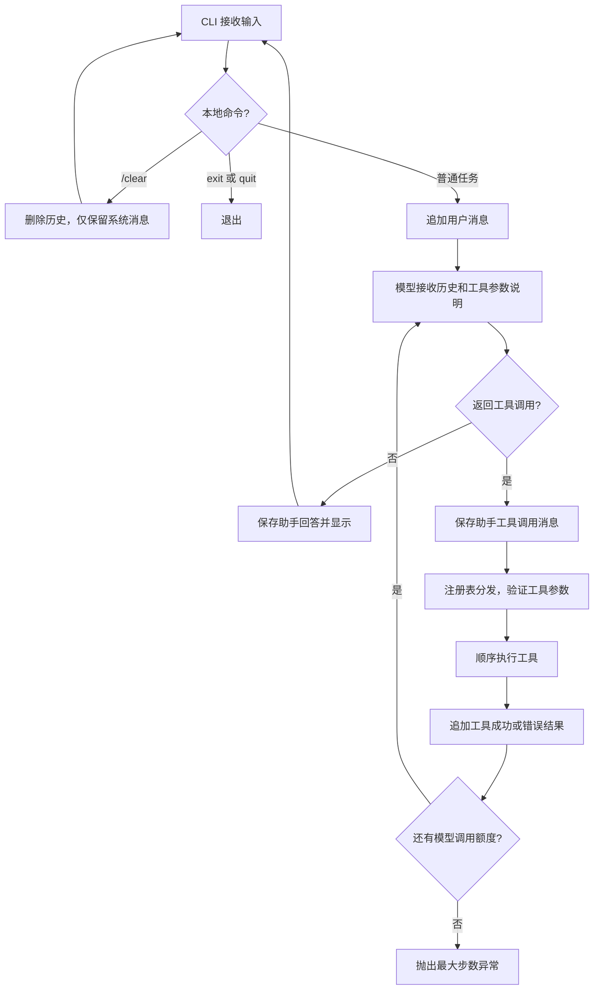

# ZipClaw

一个参考 pi 风格分层思路、使用 Python 从零实现的学习型编程智能体。

当前版本专注于最小闭环：**输入任务 → 模型选择工具 → 执行工具 → 回传结果 → 模型回答**。支持终端连续对话、查看目录和读取文件；目前能创建文件和精确编辑已有文件，尚不能执行命令或运行测试。

长期目标是逐步实现能够理解项目、修改代码、运行测试并根据结果修复问题的编程智能体。这里不是 pi-mono 的直接移植，也不是已经具备完整能力的 OpenClaw。

## 当前能力

- 在终端持续聊天，同一进程内保留对话与工具调用历史。
- 通过 OpenAI 兼容的 Chat Completions 接口调用模型，允许配置服务地址和模型名称。
- 使用 Pydantic 定义工具参数、生成 JSON 参数结构，并在执行前验证参数。
- 支持一次模型回复中的多个工具调用，当前按顺序执行。
- 保留模型返回的 `reasoning_content` 字段，在后续消息中回传。
- 使用 `list_dir` 查看目录，使用 `read_file` 读取文本文件。
- 使用 `write_file` 新建文件，不覆盖已有文件。
- 使用 `edit_file` 精确替换已有文件的一处文本，匹配不唯一时拒绝修改。
- 工具说明、模型提示词和项目自定义反馈使用中文。
- 对工具访问路径进行工作区边界检查。
- 将部分工具执行异常转换成工具结果，让模型有机会调整参数。
- 每个用户任务默认最多请求模型 10 次，避免无限循环。

配置兼容接口不代表所有服务、模型与推理模式都已经验证兼容；当前适配器仍使用同一套消息格式。

## 快速开始

以下命令以 Windows PowerShell 为例。推荐先把项目安装为 `zipclaw` 命令，以后在任意目标项目目录启动。

### 1. 准备环境

需要 uv、Python 3.12 或更新版本，以及可用的模型 API Key。使用的模型需要支持工具调用。

安装一次命令（路径替换为你自己的 ZipClaw 源码目录）：

```powershell
uv tool install --editable "C:\Users\28657\Desktop\ZipClaw"
uv tool update-shell
```

- `uv tool install` 为工具管理独立环境、安装依赖并生成命令，不使用项目的 `.venv`，也不是发布或上传项目。
- `--editable` 让命令使用这份本地源码，修改 Python 文件后无需重新安装。
- `uv tool update-shell` 按需更新 PATH，让终端能找到命令。首次设置后重新打开终端。

项目已经配置 setuptools 构建后端、`src` 包发现及命令入口：

```toml
[project.scripts]
zipclaw = "zipclaw.cli:entrypoint"
```

执行 `zipclaw` 会调用同步函数 `entrypoint()`，由它通过 `asyncio.run(main())` 启动异步 CLI。

### 2. 配置环境变量

在项目根目录创建 `.env` 文件，填写以下配置（全部示例值都需要按自己的服务替换）：

```dotenv
OPENAI_API_KEY=your_api_key_here
OPENAI_BASE_URL=https://your-provider.example/v1
OPENAI_MODEL=your_tool_capable_model_id
```

| 变量 | 说明 |
| --- | --- |
| `OPENAI_API_KEY` | 必填，模型服务的 API Key |
| `OPENAI_MODEL` | 必填，该服务实际支持的模型 ID |
| `OPENAI_BASE_URL` | 第三方兼容服务需要填写；省略时使用 SDK 默认地址 |

`OPENAI_*` 是当前代码使用的变量名，并不限制你只能使用 OpenAI 服务。使用 DeepSeek 时，填写你在 DeepSeek 使用的兼容 API 地址、模型 ID 和密钥即可；无需为了变量名称去申请另一家的密钥。

CLI 使用 `load_dotenv()` 加载配置。已有的进程环境变量通常会优先于 `.env`，修改文件后如果配置没有生效，也要检查终端里是否设置了同名变量。

`.env` 已被 `.gitignore` 忽略。不要把真实 Key 写进 README、源码或提交记录。

### 3. 启动

安装完成后，在想让 Agent 操作的目录执行：

```powershell
zipclaw
```

可以和Claude一样，直接在终端输入zipclaw即可

### 4. 试一次工具调用

```text
> 先查看项目根目录，再读取 pyproject.toml，告诉我用了哪些依赖。

ZipClaw > ……

> 再看看 src/zipclaw/core 目录。

ZipClaw > ……
```

工具结果会进入模型上下文，终端默认显示模型的最终回答，不会直接打印全部工具返回值。因此“读取文件”可能得到总结，而不是逐字原文。

### 修改源码后如何生效

可编辑安装后，修改 `.py` 文件，只需在正在运行的 ZipClaw 中输入 `exit`，然后回到 PowerShell 再执行 `zipclaw`。新进程会加载更新后的源码；原来进程不会自动热更新。

不需要重新打开终端，也不需要每次修改都运行安装命令。因为历史仅保存在内存中，重启后会开启新对话。

如果修改了依赖、包配置或命令入口，可以重新安装工具环境：

```powershell
uv tool install --force --editable "C:\Users\28657\Desktop\ZipClaw"
```

可编辑安装依赖原源码目录。移动目录后应按新路径重新安装，不要直接删除源码目录。

### 可选：使用项目本地环境开发

如果不需要用户级 `zipclaw` 命令，也可以在 ZipClaw 根目录执行：

```powershell
uv sync
.\.venv\Scripts\python.exe -m zipclaw.cli
```

`uv sync` 管理项目 `.venv`，与 `uv tool install` 管理的工具环境是两套环境。更新其中一套的依赖，不代表另一套同步更新。这里仍按包启动，不要直接运行 `src/zipclaw/cli.py`。

## 聊天命令

| 输入 | 行为 |
| --- | --- |
| 普通文本 | 追加到当前会话，交给 Agent 执行 |
| `/clear` | 本地删除对话历史，只保留系统消息，不调用模型 |
| `exit` 或 `quit` | 退出程序，大小写均可 |
| 空输入 | 忽略，不调用模型 |

注意：当前只有 **`/clear`** 是清空命令。

历史只保存在内存中，退出后不会恢复。清空对话不会删除工作区文件，模型之后仍可通过工具重新读取文件。

## 工作区

工作区取自 `Path.cwd()`，也就是**启动时终端所在目录**，不是固定的源码目录。启动时会打印实际工作区。

模型使用相对于工作区根目录的路径，例如 `src/main.py`。工具负责拼接路径并检查是否越界。代码当前限制的是“不能访问工作区外”，并未单独禁止工作区内的绝对路径输入。

安装命令后，要分析其他项目，只需切换目录运行：

```powershell
# 替换成要分析的项目目录。
Set-Location "C:\path\to\another-project"
zipclaw
```

安装位置决定运行哪个程序，启动目录决定操作哪个工作区。这个启动方式不会解除工具的工作区访问限制。

当前 CLI 没有显式指定 `.env` 路径。可编辑安装、普通非调试启动时，`load_dotenv()` 从调用它的源码位置向上查找，可继续使用 ZipClaw 根目录的 `.env` 或启动进程的环境变量。不要假定切换工作区就会加载目标项目的 `.env`。

## 项目结构

```text
ZipClaw/
├── pyproject.toml              # 依赖、构建配置、命令入口与 uv 索引
├── uv.lock                     # uv 依赖锁定文件
├── README.md
└── src/
    └── zipclaw/
        ├── __init__.py
        ├── cli.py              # 配置加载、工具注册、终端输入输出
        ├── core/
        │   ├── __init__.py
        │   └── loop.py         # 对话历史和模型—工具执行循环
        ├── llm/
        │   ├── base.py         # BaseLLM 抽象接口
        │   ├── types.py        # LLMResponse、ToolCall 数据模型
        │   └── openai_llm.py   # 兼容接口适配与参数解析
        └── tools/
            ├── __init__.py
            ├── base.py         # 工具参数结构、参数验证与执行接口
            ├── registry.py     # 工具注册、查找与分发
            └── filesystem/
                ├── __init__.py
                ├── list_dir.py
                ├── read_file.py
                ├── write_file.py
                └── edit_file.py
```

推荐阅读顺序：`cli.py` → `core/loop.py` → `llm/types.py` → `llm/openai_llm.py` → `tools/base.py` → `tools/registry.py` → 具体工具。

## 执行流程



`self.messages` 保存会话历史。`run()` 中的 `messages = self.messages` 引用同一个列表，因此 `append()` 会直接更新历史，不需要额外赋回。

## 内置工具

### list_dir

列出目录的直接子项，不递归，也不读取文件内容。

```json
{"path": "src/zipclaw", "max_entries": 100}
```

- `path` 默认是 `.`。
- `max_entries` 默认 100，范围为 1～500。
- 输出按名称排序，并标记 `[目录]`、`[文件]`、`[链接]` 或 `[其他]`。
- 返回工作区相对路径，可直接用于下一次工具调用。
- 超出输出数量时显示截断提示；当前没有分页。
- 数量上限仅限制返回条目数，排序仍会收集当前目录全部子项。

### read_file

读取工作区内的文本文件：

```json
{"path": "src/zipclaw/core/loop.py"}
```

- `path` 必填。
- 使用 UTF-8 解码，无法解码的内容替换为占位字符。
- 保留原始换行，便于编辑工具精确匹配读取到的文本。
- 当前一次读取完整文件，没有按行读取或大小上限。
- 路径不存在或不是普通文件时返回提示，越界访问被拒绝。

这些 JSON 是工具参数示例；平时直接在终端描述任务，由模型决定如何调用工具。

### write_file

创建工作区内的新 UTF-8 文本文件：

```json
{"path": "src/demo.py", "content": "print('你好')\n"}
```

- 自动创建缺失的父目录，允许创建空文件。
- 已有文件、目录或目标符号链接会被拒绝。
- 使用独占创建模式，不覆盖已有文件。

### edit_file

修改已有 UTF-8 文本文件的一处内容：

```json
{"path": "src/demo.py", "old_text": "print('你好')", "new_text": "print('欢迎')"}
```

- 编辑前先读取文件；旧文本必须非空且恰好匹配一次。
- 空格、缩进和换行必须与原文一致；不自动猜测修改位置。
- 新文本允许为空，表示删除旧文本。
- 不创建文件；缺失文件、匹配失败或多处匹配均拒绝修改。
- 保存前在内存中生成完整新内容；当前没有差异确认或原子保存。

## 如何扩展工具

1. 用 Pydantic `BaseModel` 定义参数类。
2. 创建继承 `BaseTool` 的工具类。
3. 设置 `name`、`description`、`args_model`。
4. 实现异步 `execute()`，并在涉及文件时检查工作区边界。
5. 在 `cli.py` 创建并注册工具。

`BaseTool.run()` 会验证参数，`ToolRegistry.schemas()` 会自动提供工具描述，通常不需要修改智能体主循环。

## 当前限制与注意事项

- 已支持新建和编辑文件，但尚未实现命令执行、测试执行、Git 操作、即时消息平台或后台运行接入。
- 编辑文件仍直接写入原文件，缺少原子保存、并发修改检查、差异确认和自动备份。
- 新建和编辑工具没有用户确认流程，仅在确认允许修改的项目中使用。
- 历史没有持久化、摘要压缩或上下文长度预算，长时间聊天会增加上下文与调用成本。
- 工具层处理了部分预期异常，但 API 请求失败、无效 JSON 参数等仍可能导致程序退出。
- 达到最大步数会抛出异常，目前 CLI 没有完整的中断恢复机制。
- 没有流式输出或工具执行过程展示，等待期间可能暂时没有终端输出。
- 工作区检查不是操作系统级沙箱；不要把当前版本当作适合不可信远程用户的服务。
- `.gitignore` 只影响 Git，不限制工具读取。当前未阻止读取 `.env` 等敏感文件。
- 读取内容会随工具结果发送给配置的模型服务，即使程序运行在个人电脑上也不例外。
- 目录内容、源码注释都可能包含不可信文字，当前没有完整的提示注入防护。

## 后续方向（尚未实现）

1. 补充自动化测试、读取上限与更清楚的失败提示。
2. 增加搜索工具，完善编辑工具的保存方式，并在写入前加入确认和变更检查。
3. 增加受控命令执行、测试与修复闭环。
4. 按实际需要加入会话持久化、上下文管理和更多模型适配。
5. 核心能力稳定后，再考虑 IM 接入与长期后台运行。

学习阶段优先跑通并理解每一个小闭环，不一次性堆满所有模块。
